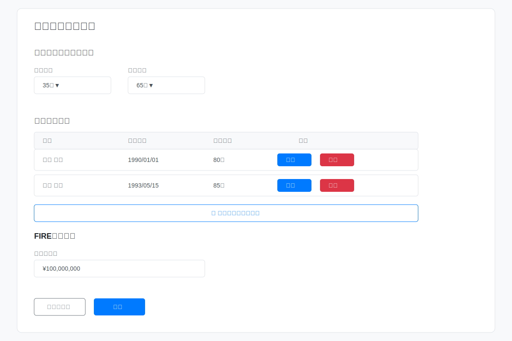
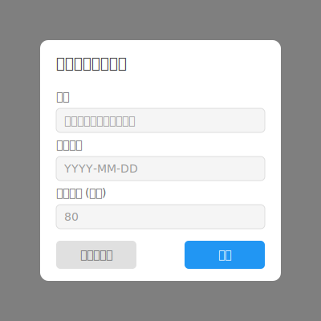
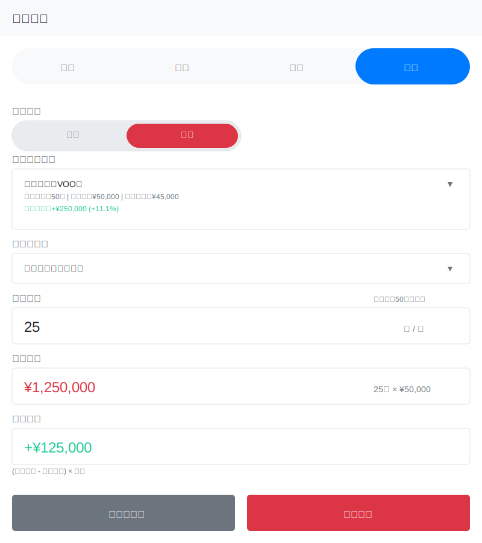
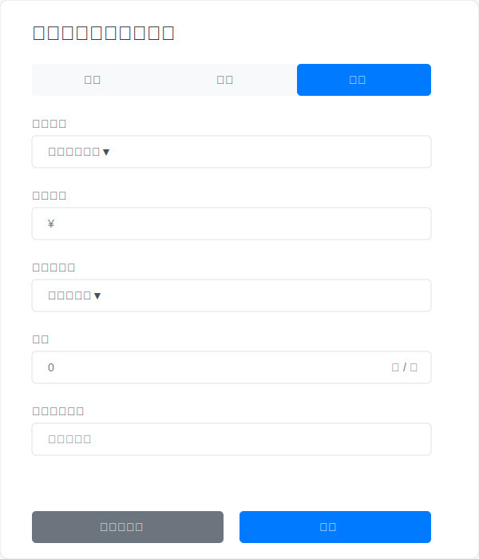
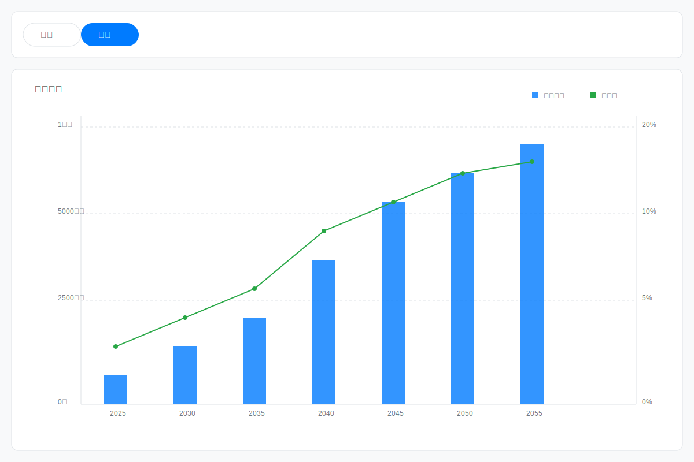

# ライフプランアプリ 画面設計

## 画面一覧

### 0. 初期画面およびライフプラン作成
#### ライフプラン作成

#### 家族メンバーフォーム

### 1. 共通部分
#### ヘッダー

### 2. メイン画面
#### ダッシュボード

#### 取引一覧
##### 支出取引

##### 収入取引

##### 振替取引

##### 投資取引

#### 取引フォーム
##### 支出取引フォーム

##### 収入取引フォーム

##### 振替取引フォーム

##### 投資取引フォーム

###### 買付フォーム

###### 売却フォーム

### 3. カテゴリ管理
#### カテゴリ一覧

#### カテゴリフォーム
##### 支出カテゴリフォーム

##### 収入カテゴリフォーム

### 4. 口座管理
#### 口座一覧

#### 口座詳細

#### 口座フォーム

### 5. 資産管理
#### 資産一覧

#### 資産詳細

#### 資産フォーム

#### 保有資産詳細

### 6. イベント管理
#### イベント一覧

#### イベントフォーム

### 7. テンプレート管理
#### テンプレート一覧
##### 支出テンプレート一覧

##### 収入テンプレート一覧

##### 投資テンプレート一覧

#### テンプレートモーダル
##### 支出テンプレートモーダル

##### 収入テンプレートモーダル

##### 投資テンプレートモーダル

#### テンプレートフォーム
##### 支出テンプレートフォーム

##### 収入テンプレートフォーム

##### 投資テンプレートフォーム

### 8. レポート・分析

#### レポート
##### 口座タブ

##### 資産タブ

### 9. 設定
#### 設定一覧

#### 設定詳細

#### FIRE計画
